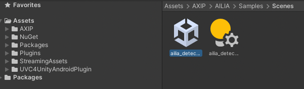
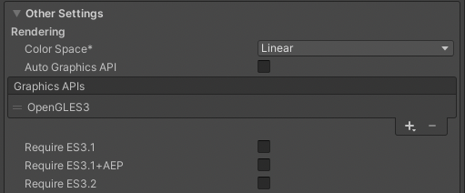
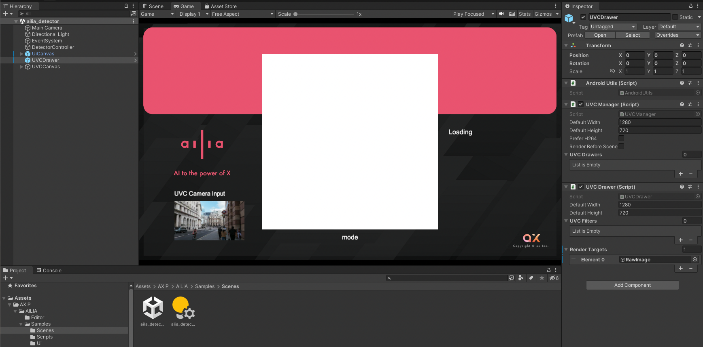
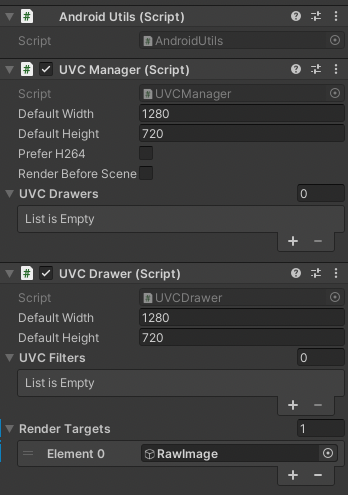
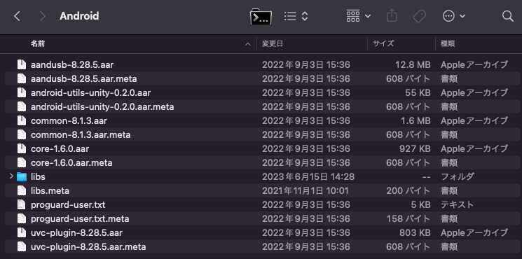

# ailia-android-uvc-camera

Unity on Android cannot handle external USB cameras. You can use an external USB camera by using UVC4UnityAndroid.

## Architecture

In UVC4UnityAndroid, you can get the camera image by dropping UVCDrawer.prefab to Scene and giving UI/RawImage to RenderTargets of prefab.

GetPixels32 can be executed by blitting the RawImage texture once and giving it Read/Write attributes. Infer the obtained pixel value with ailia.

## Environment

- macOS 12.6
- ailia SDK 1.2.14.1
- Unity 2021.3.10f1
- NuGet 3.1.0
- UVC4UnityAndroid 0.2.1 or 0.2.2

## Setup

Clone this repository.

```
git clone git@github.com:axinc-ai/ailia-android-uvc-camera.git
```

Import ailia SDK unity package (Plugins folder only)

https://axinc.jp/trial/

Import NuGetForUnity.3.1.0.unitypackage.

https://github.com/GlitchEnzo/NuGetForUnity/releases

Instal System.Text.Json from NuGet.

- Select Manage NuGet Packages from NuGet menu.
- Search System.Text.Json from search box.
- Select System.Text.Json and install it.

Import release package of UVC4UnityAndroid_0.2.1.unitypackage

https://github.com/saki4510t/UVC4UnityAndroid/tree/master/release

## Project settings

The folder structure after import is as follows.



Set your Render settings to OpenGL, as it won't work with Vulkan.



## Run

Open and Run unity scene.

```
/Assets/AXIP/AILIA/Samples/Scenes/ailia_detector.unity
```



The image of the camera is drawn to RawImage.



## For Arm Mali

An OpenGL shader error may occur when using Arm Mali. In that case, you need to download the 0.2.2 binary from UVC4UnityAndroid's github.

Specifically, download the Plugins folder from github and overwrite the 0.2.1 environment.



## Prebuilt app

You can download prebuilt binary here.

[ailia_uvc_camera.apk](Release/ailia_uvc_camera.apk)
